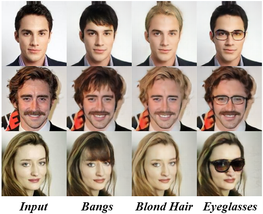
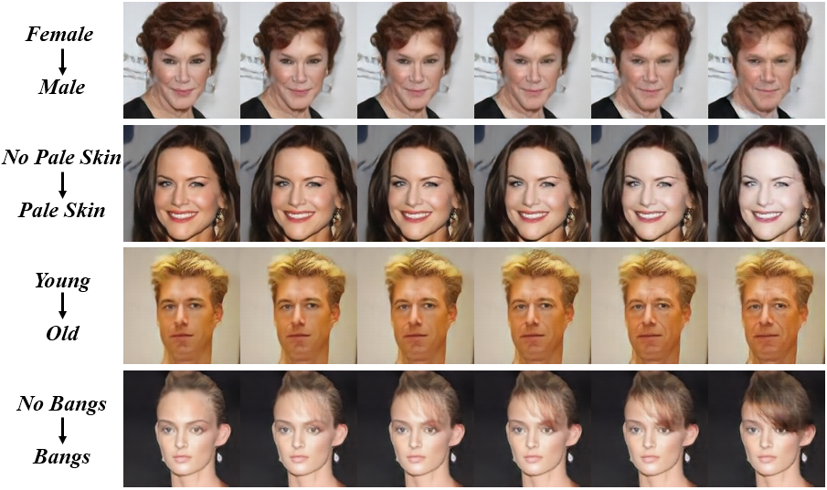
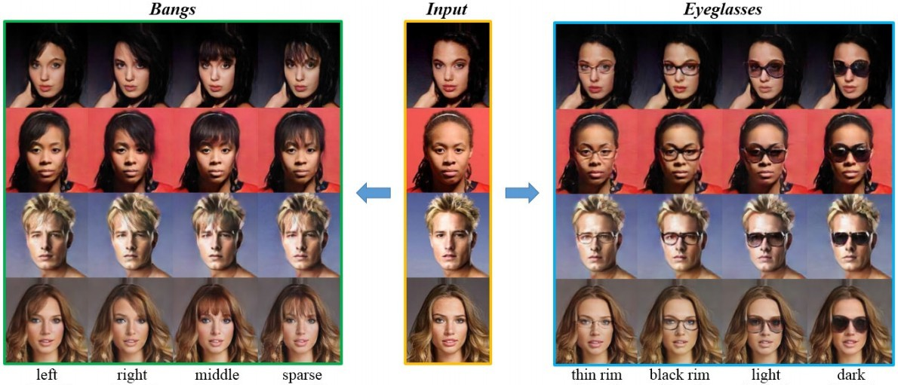
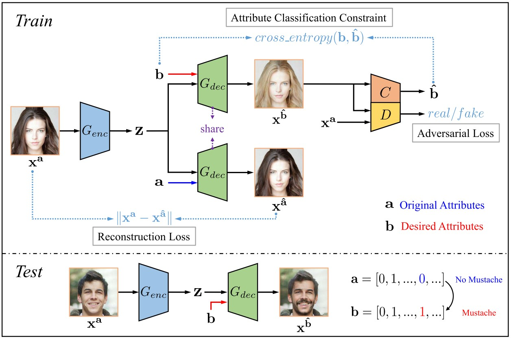
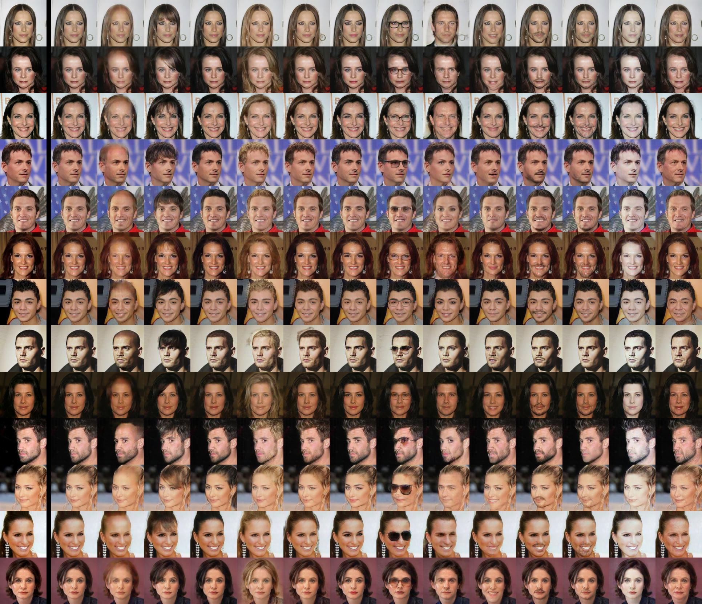

***New***

- We clean up the code to make it more readable! The old version is here: [v1](https://github.com/LynnHo/AttGAN-Tensorflow/tree/v1).

<hr style="height:1px" />

<p align="center"> &nbsp;&nbsp;&nbsp;&nbsp;&nbsp; </p>

<p align="center">  </p>

<hr style="height:1px" />

# <p align="center"> [AttGAN](https://ieeexplore.ieee.org/document/8718508?source=authoralert) <br> <sub><sub> [TIP Nov. 2019](https://ieeexplore.ieee.org/document/8718508?source=authoralert), [arXiv Nov. 2017](https://arxiv.org/pdf/1711.10678v1.pdf) </sub></sub> </p>

**TensorFlow** implementation of **AttGAN**: Facial Attribute Editing by Only Changing What You Want

<p align="center">  </p>

## Related

- Other implementations of AttGAN

    - [AttGAN-PyTorch](https://github.com/elvisyjlin/AttGAN-PyTorch) by Yu-Jing Lin

    - [AttGAN-PaddlePaddle](https://github.com/PaddlePaddle/models/tree/develop/PaddleCV/gan) by ceci3 and zhumanyu (**AttGAN is one of the official reproduced models of [PaddlePaddle](https://github.com/PaddlePaddle?type=source)**)

- Closely related works

    - **An excellent work built upon our code - [STGAN](https://github.com/csmliu/STGAN) (CVPR 2019) by Ming Liu**

    - [Changing-the-Memorability](https://github.com/acecreamu/Changing-the-Memorability) (CVPR 2019 MBCCV Workshop) by acecreamu

    - [Fashion-AttGAN](https://github.com/ChanningPing/Fashion_Attribute_Editing) (CVPR 2019 FSS-USAD Workshop) by Qing Ping

- An unofficial [demo video](https://www.youtube.com/watch?v=gnN4ZjEWe-8) of AttGAN by 王一凡

## Exemplar Results

- See [results.md](./results.md) for more results, we try **higher resolution** and **more attributes** (all **40** attributes!!!)

- Inverting 13 attributes respectively

    from left to right: *Input, Reconstruction, Bald, Bangs, Black_Hair, Blond_Hair, Brown_Hair, Bushy_Eyebrows, Eyeglasses, Male, Mouth_Slightly_Open, Mustache, No_Beard, Pale_Skin, Young*

    

## Usage

- Environment

    - Python 3.6

    - TensorFlow 1.15

    - OpenCV, scikit-image, tqdm, oyaml

    - *we recommend [Anaconda](https://www.anaconda.com/distribution/#download-section) or [Miniconda](https://docs.conda.io/en/latest/miniconda.html#linux-installers), then you can create the AttGAN environment with commands below*

        ```console
        conda create -n AttGAN python=3.6

        source activate AttGAN

        conda install -c anaconda tensorflow-gpu=1.15

        conda install -c anaconda opencv

        conda install -c anaconda scikit-image

        conda install -c anaconda tqdm

        conda install -c conda-forge oyaml
        ```

- Data Preparation

    - [CelebA](http://openaccess.thecvf.com/content_iccv_2015/papers/Liu_Deep_Learning_Face_ICCV_2015_paper.pdf)-unaligned (10.2GB, higher quality than the aligned data)

        - download the dataset

            - img_celeba.7z (move to **./data/img_celeba/img_celeba.7z**): [Google Drive](https://drive.google.com/drive/folders/0B7EVK8r0v71pTUZsaXdaSnZBZzg) or [Baidu Netdisk](https://pan.baidu.com/s/1eSNpdRG#list/path=%2Fsharelink2785600790-938296576863897%2FCelebA%2FImg&parentPath=%2Fsharelink2785600790-938296576863897)

            - annotations.zip (move to **./data/img_celeba/annotations.zip**): [Google Drive](https://drive.google.com/file/d/1xd-d1WRnbt3yJnwh5ORGZI3g-YS-fKM9/view?usp=sharing)

        - unzip and process the data

            ```console
            7z x ./data/img_celeba/img_celeba.7z/img_celeba.7z.001 -o./data/img_celeba/

            unzip ./data/img_celeba/annotations.zip -d ./data/img_celeba/

            python ./scripts/align.py
            ```

- Run AttGAN

    - *NOTICE: if you create a new conda environment, remember to activate it before any command*

        ```console
        source activate AttGAN
        ```

    - training (see [examples.md](./examples.md) for more training commands)

        ```console
        CUDA_VISIBLE_DEVICES=0 \
        python train.py \
        --load_size 143 \
        --crop_size 128 \
        --model model_128 \
        --experiment_name AttGAN_128
        ```

    - testing

        - **single** attribute editing (inversion)

            ```console
            CUDA_VISIBLE_DEVICES=0 \
            python test.py \
            --experiment_name AttGAN_128
            ```


        - **multiple** attribute editing (inversion) example

            ```console
            CUDA_VISIBLE_DEVICES=0 \
            python test_multi.py \
            --test_att_names Bushy_Eyebrows Pale_Skin \
            --experiment_name AttGAN_128
            ```

        - attribute sliding example

            ```console
            CUDA_VISIBLE_DEVICES=0 \
            python test_slide.py \
            --test_att_name Pale_Skin \
            --test_int_min -2 \
            --test_int_max 2 \
            --test_int_step 0.5 \
            --experiment_name AttGAN_128
            ```

    - loss visualization

        ```console
        CUDA_VISIBLE_DEVICES='' \
        tensorboard \
        --logdir ./output/AttGAN_128/summaries \
        --port 6006
        ```

    - convert trained model to .pb file

        ```console
        python to_pb.py --experiment_name AttGAN_128
        ```

- Using Trained Weights

    - alternative trained weights (move to **./output/\*.zip**)

        - [AttGAN_128.zip](https://drive.google.com/file/d/1Oy4F1xtYdxj4iyiLyaEd-dkGIJ0mwo41/view?usp=sharing) (987.5MB)

            - *including G, D, and the state of the optimizer*

        - [AttGAN_128_generator_only.zip](https://drive.google.com/file/d/1lcQ-ijNrGD4919eJ5Dv-7ja5rsx5p0Tp/view?usp=sharing) (161.5MB)

            - *G only*

        - [AttGAN_384_generator_only.zip](https://drive.google.com/open?id=1scaKWcWIpTfsV0yrWCI-wg_JDmDsKKm1) (91.1MB)


    - unzip the file (AttGAN_128.zip for example)

        ```console
        unzip ./output/AttGAN_128.zip -d ./output/
        ```

    - testing (see above)


- Example for Custom Dataset

    - [AttGAN-Cartoon](https://github.com/LynnHo/AttGAN-Cartoon-Tensorflow)

## Citation

If you find [AttGAN](https://ieeexplore.ieee.org/document/8718508?source=authoralert) useful in your research work, please consider citing:

    @ARTICLE{8718508,
    author={Z. {He} and W. {Zuo} and M. {Kan} and S. {Shan} and X. {Chen}},
    journal={IEEE Transactions on Image Processing},
    title={AttGAN: Facial Attribute Editing by Only Changing What You Want},
    year={2019},
    volume={28},
    number={11},
    pages={5464-5478},
    keywords={Face;Facial features;Task analysis;Decoding;Image reconstruction;Hair;Gallium nitride;Facial attribute editing;attribute style manipulation;adversarial learning},
    doi={10.1109/TIP.2019.2916751},
    ISSN={1057-7149},
    month={Nov},}