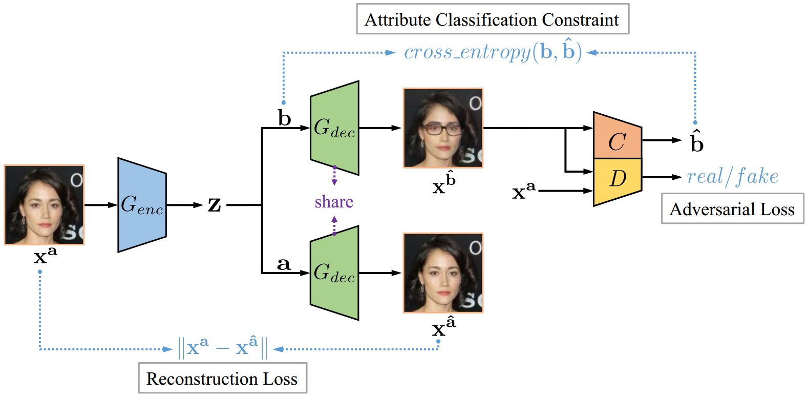
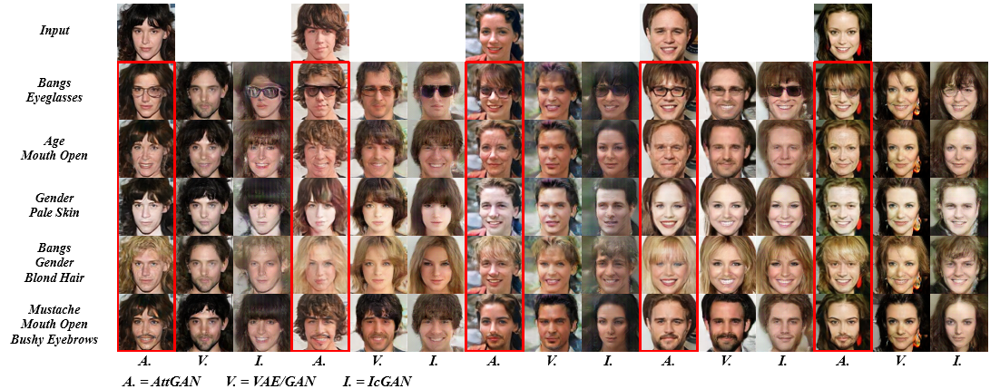

&nbsp;&nbsp;&nbsp;&nbsp;&nbsp;&nbsp;&nbsp;&nbsp;&nbsp;
---

# <p align="center"> [AttGAN](https://arxiv.org/abs/1711.10678) </p>

**Tensorflow** implementation of **AttGAN** - [Arbitrary Facial Attribute Editing: Only Change What You Want](https://arxiv.org/abs/1711.10678)

<p align="center">  </p>

## Exemplar Results

- See [results.md](./results.md) for more results, we try **higher resolution** and **more attributes** (all **40** attributes!!!) here

- Inverting 13 attributes respectively

    from left to right: *Input, Reconstruction, Bald, Bangs, Black_Hair, Blond_Hair, Brown_Hair, Bushy_Eyebrows, Eyeglasses, Male, Mouth_Slightly_Open, Mustache, No_Beard, Pale_Skin, Young*

    

- Comparisons with [VAE/GAN](https://arxiv.org/abs/1512.09300) and [IcGAN](https://arxiv.org/abs/1611.06355) on inverting ***single*** attribute

    

- Comparisons with [VAE/GAN](https://arxiv.org/abs/1512.09300) and [IcGAN](https://arxiv.org/abs/1611.06355) on simultaneously inverting ***multiple*** attributes

    

## Usage

- Prerequisites
    - Tensorflow 1.7 or 1.8
    - Python 2.7 or 3.6

- Dataset
    - [Celeba](http://openaccess.thecvf.com/content_iccv_2015/papers/Liu_Deep_Learning_Face_ICCV_2015_paper.pdf) dataset
        - [Images](https://www.dropbox.com/sh/8oqt9vytwxb3s4r/AADSNUu0bseoCKuxuI5ZeTl1a/Img?dl=0&preview=img_align_celeba.zip) should be placed in ***./data/img_align_celeba/\*.jpg***
        - [Attribute labels](https://www.dropbox.com/sh/8oqt9vytwxb3s4r/AAA8YmAHNNU6BEfWMPMfM6r9a/Anno?dl=0&preview=list_attr_celeba.txt) should be placed in ***./data/list_attr_celeba.txt***
        - the above links might be inaccessible, the alternative is
            - ***img_align_celeba.zip***
                - https://pan.baidu.com/s/1eSNpdRG#list/path=%2FCelebA%2FImg or
                - https://drive.google.com/drive/folders/0B7EVK8r0v71pTUZsaXdaSnZBZzg
            - ***list_attr_celeba.txt***
                - https://pan.baidu.com/s/1eSNpdRG#list/path=%2FCelebA%2FAnno&parentPath=%2F or
                - https://drive.google.com/drive/folders/0B7EVK8r0v71pOC0wOVZlQnFfaGs

    - [HD-Celeba](https://github.com/LynnHo/HD-CelebA-Cropper) (optional)
        - the images of ***img_align_celeba.zip*** are low resolution and uncropped, higher resolution and cropped images are available [here](https://github.com/LynnHo/HD-CelebA-Cropper)
        - the high quality data should be placed in ***./data/img_crop_celeba/\*.jpg***

- [Well-trained models](https://drive.google.com/open?id=11uEWeQNLAs7eOPcZkfKkraQuYS-LGz_7): download the models you need and unzip the files to ***./output/*** as below,

    ```
    output
    ├── 128_shortcut1_inject1_none
    └── 384_shortcut1_inject1_none_hd
    ```

- Examples of training
    - see [examples.md](./examples.md) for more examples

    - training

        - for 128x128 images

            ```console
            CUDA_VISIBLE_DEVICES=0 \
            python train.py \
            --img_size 128 \
            --shortcut_layers 1 \
            --inject_layers 1 \
            --experiment_name 128_shortcut1_inject1_none
            ```

        - for 384x384 images

            ```console
            CUDA_VISIBLE_DEVICES=0 \
            python train.py \
            --img_size 384 \
            --enc_dim 48 \
            --dec_dim 48 \
            --dis_dim 48 \
            --dis_fc_dim 512 \
            --shortcut_layers 1 \
            --inject_layers 1 \
            --n_sample 24 \
            --experiment_name 384_shortcut1_inject1_none
            ```

        - for 384x384 HD images (need [HD-Celeba](https://github.com/LynnHo/HD-CelebA-Cropper))

            ```console
            CUDA_VISIBLE_DEVICES=0 \
            python train.py \
            --img_size 384 \
            --enc_dim 48 \
            --dec_dim 48 \
            --dis_dim 48 \
            --dis_fc_dim 512 \
            --shortcut_layers 1 \
            --inject_layers 1 \
            --n_sample 24 \
            --use_cropped_img \
            --experiment_name 384_shortcut1_inject1_none_hd
            ```

    - tensorboard for loss visualization

        ```console
        CUDA_VISIBLE_DEVICES='' \
        tensorboard \
        --logdir ./output/128_shortcut1_inject1_none/summaries \
        --port 6006
        ```

- Example of testing ***single*** attribute

    ```console
    CUDA_VISIBLE_DEVICES=0 \
    python test.py \
    --experiment_name 128_shortcut1_inject1_none \
    --test_int 1.0
    ```

- Example of testing ***multiple*** attributes

    ```console
    CUDA_VISIBLE_DEVICES=0 \
    python test_multi.py \
    --experiment_name 128_shortcut1_inject1_none \
    --test_atts Pale_Skin Male \
    --test_ints 0.5 0.5
    ```

- Example of attribute intensity control

    ```console
    CUDA_VISIBLE_DEVICES=0 \
    python test_slide.py \
    --experiment_name 128_shortcut1_inject1_none \
    --test_att Male \
    --test_int_min -1.0 \
    --test_int_max 1.0 \
    --n_slide 10
    ```

## Citation
If you find [AttGAN](https://arxiv.org/abs/1711.10678) useful in your research work, please consider citing:

    @article{he2017arbitrary,
      title={Arbitrary Facial Attribute Editing: Only Change What You Want},
      author={He, Zhenliang and Zuo, Wangmeng and Kan, Meina and Shan, Shiguang and Chen, Xilin},
      journal={arXiv preprint arXiv:1711.10678},
      year={2017}
    }