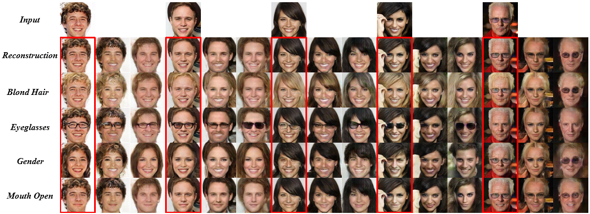
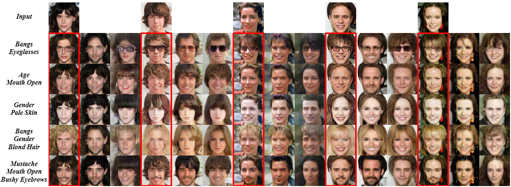

<p align="center">   </p>

# <center> [AttGAN](https://arxiv.org/abs/1711.10678) </center>

Tensorflow implementation of AttGAN - [Arbitrary Facial Attribute Editing: Only Change What You Want](https://arxiv.org/abs/1711.10678)

<center>  </center>

## Exemplar Results

- Inverting 13 attributes respectively (From left to right: Input, Reconstruction, Bald, Bangs, Black_Hair, Blond_Hair, Brown_Hair, Bushy_Eyebrows, Eyeglasses, Male, Mouth_Slightly_Open, Mustache, No_Beard, Pale_Skin, Young)

    

- Comparisons with [VAE/GAN](https://arxiv.org/abs/1512.09300) and [IcGAN](https://arxiv.org/abs/1611.06355) on inverting ***single*** attribute

    

- Comparisons with [VAE/GAN](https://arxiv.org/abs/1512.09300) and [IcGAN](https://arxiv.org/abs/1611.06355) on simultaneously inverting ***multiple*** attributes

    

## Usage

- Prerequisites
    - tensorflow 1.7 or 1.8
    - python 2.7 or 3.6

- [Celeba](http://openaccess.thecvf.com/content_iccv_2015/papers/Liu_Deep_Learning_Face_ICCV_2015_paper.pdf) dataset
    - [Images](https://www.dropbox.com/sh/8oqt9vytwxb3s4r/AADSNUu0bseoCKuxuI5ZeTl1a/Img?dl=0&preview=img_align_celeba.zip) should be placed in ***./data/img_align_celeba/\*.jpg***
    - [Attribute labels](https://www.dropbox.com/sh/8oqt9vytwxb3s4r/AAA8YmAHNNU6BEfWMPMfM6r9a/Anno?dl=0&preview=list_attr_celeba.txt) should be placed in ***./data/list_attr_celeba.txt***

- Example of training
    - training

        ```python
        CUDA_VISIBLE_DEVICES=0 python train.py --img_size 128 --shortcut_layers 1 --inject_layers 1 --experiment_name 128_shortcut1_inject1_none
        ```

    - tensorboard for loss visualization

        ```python
        CUDA_VISIBLE_DEVICES='' tensorboard --logdir ./output/128_shortcut1_inject1_none/summaries --port 6006
        ```

- Example of testing ***single*** attribute

    ```python
    CUDA_VISIBLE_DEVICES=0 python test.py --experiment_name 128_shortcut1_inject1_none --test_int 1.0
    ```

- Example of testing ***multiple*** attributes

    ```python
    CUDA_VISIBLE_DEVICES=0 python test_multi.py --experiment_name 128_shortcut1_inject1_none --test_atts Pale_Skin Male --test_ints 0.5 0.5
    ```

- Example of attribute intensity control

    ```python
    CUDA_VISIBLE_DEVICES=0 python test_slide.py --experiment_name 128_shortcut1_inject1_none --test_att Male --test_int_min -1.0 --test_int_max 1.0 --n_slide 10
    ```

## Citation
If you find [AttGAN](https://arxiv.org/abs/1711.10678) useful in your research work, please consider citing:

    @article{he2017arbitrary,
      title={Arbitrary Facial Attribute Editing: Only Change What You Want},
      author={He, Zhenliang and Zuo, Wangmeng and Kan, Meina and Shan, Shiguang and Chen, Xilin},
      journal={arXiv preprint arXiv:1711.10678},
      year={2017}
    }